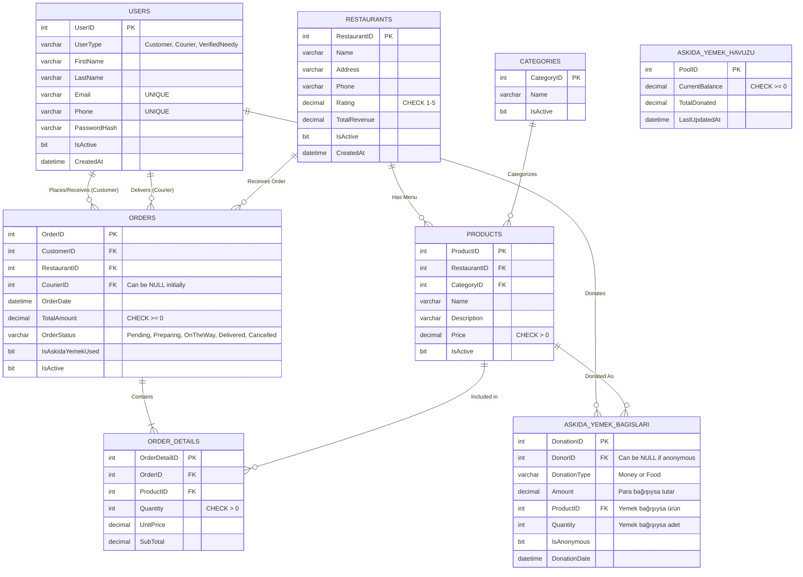

# Varlık-İlişki (ER) Diyagramı

Aşağıdaki diyagram, Çevrimiçi Yemek Sipariş Platformu ve "Askıda Yemek" modülünün veritabanı tablolarını ve aralarındaki ilişkileri (Primary Key - Foreign Key) göstermektedir.

## İlişki Açıklamaları
- **1:N (Bire Çok)**: Bir müşteri (Users) birden fazla sipariş (Orders) verebilir. (Aynı şekilde kurye birden çok sipariş taşıyabilir).
- **1:N (Bire Çok)**: Bir restoranın birden fazla ürünü (Products) ve siparişi (Orders) olabilir.
- **1:N (Bire Çok)**: Bir kategoride birden fazla ürün bulunabilir.
- **1:N (Bire Çok)**: Bir müşteri (veya ihtiyaç sahibi olmayanlar) birden fazla askıda yemek bağışı (AskidaYemekBagislari) yapabilir.
- **1:N (Bire Çok)**: Bir siparişin içinde birden fazla sipariş detayı (OrderDetails) yani farklı ürün kalemleri bulunabilir.
- **1:N (Bire Çok)**: Bir ürün, birden fazla sipariş detayında (OrderDetails) yer alabilir.
- *AskidaYemekHavuzu* tablosu sistemde tek satır olarak (Singleton benzeri) durur, doğrudan bir Foreign Key bağı yoktur ancak Trigger'lar aracılığıyla Siparişler ve Bağışlar tablolarıyla iş kuralları (Business Logic) gereği bağlantılıdır.
